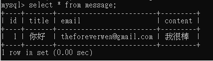

# 作品介紹

本網站使用django架設，結合python爬蟲的資料，添加文字搜尋、分頁功能將網站呈現

****
## 目錄
* 網頁導覽及功能介紹
* 未來目標

****
## 網頁導覽及功能介紹

## Home主頁  
* 上方使用Bootstrap資源的navbar設立導覽列  
* 內容放置想要主打的熱門商品(從資料庫抓出排序熱賣或最新上架的商品)  
* 點選"查看更多"進入該商品的主頁面

# 加碼券專區分頁
* 結合政府振興加碼券議題，製作加碼券兌獎器  
* 運用Python爬蟲抓取可以使用加碼券的網站資料(用klook及kkday網站為範例) 
>

# 加碼券兌獎器  
這邊放置了一些圖片增加兌獎的樂趣，敬請見諒(由於此為範例練習網站，圖片來源皆從google抓取)  
* 中獎
>   
* 沒有中獎
>  

# klool主頁面  
* 建立關鍵字、價格範圍查詢、分頁功能  
* 使用get方法帶入參數實行分頁
* 點選圖片可以直接到klook網站購買  
// 也可以分開差詢(只查詢關鍵字或價格都可以)
> 
>  

# kkday主頁面 
* 建立關鍵字、旅遊縣市、價格範圍查詢、分頁功能  
* 使用get方法帶入參數實行分頁，也可以分開差詢(旅遊縣市可改成下拉式選單或顯示熱門縣市按鈕)
* 商品的顯示資料都是透過資料庫排序後呈現，旁邊可以新增下拉選單，依價格、上架時間等供使用者選擇
* 點選圖片可以直接到kkday網站購買 
>  
 
## python爬蟲應用
* 爬取youtube及Foodpanda網站作為範例
>

# youtube
* 串接youtube api的頻道，取得影片觀看次數、按讚數、發布日期等資訊
* 另外有使用Matplotlib將觀看次數、影片發布數量畫成長條圖(https://tsengsakurazaka46.github.io/youtube_sakamichi/templates/home)
* 未來可以新增影片排序的下拉選單、追蹤顯示按讚次數最高的留言等應用
* 點選圖片可直接連結到Youtube收看
>  

# Foodpanda
* 建立餐廳關鍵字搜尋、分頁功能
* 未來可以新增縣市餐廳索引、餐廳評價等下拉選單供使用者選擇
>

# 留言板

## 問題回報
* 輸入欄位資料後，可以透過admin後端及mysql查看
>
>
>

## 瀏覽訊息
>

## 張貼訊息
>

##聯絡管理員
>

